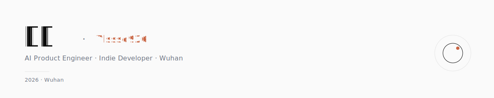

<picture>
  <source media="(prefers-color-scheme: dark)" srcset="./assets/header-dark.svg">
  
</picture>

AI 产品经理，独立开发者，住在武汉。
做工具、做产品，偶尔给别人的项目搭把手。

---

### 🔨 What I'm Building

| Project | Stats | Description |
|---|---|---|
| [clawclip](https://github.com/Ylsssq926/clawclip) | <nobr>&nbsp;</nobr> | Cut your OpenClaw / ZeroClaw token bill. Find which model earns its cost. Local, no upload. |
| [relic.skill](https://github.com/Ylsssq926/relic.skill) | <nobr>&nbsp;</nobr> | 万物皆可 Relic · 给灵魂开个 GitHub 🧬 🏆 飞书 CLI 大赛人气赛道第一名 |
| AI 简历工坊 | | 私有，开发中 |
| 入戏 | | 沉浸式角色扮演体验，私有 |
| 几款独立游戏 | | 包括 galgame，开发中 |

---

### 🤝 Contributions

| Project | PR | Stats | Description |
|---|---|---|---|
| [mcpproxy-go](https://github.com/smart-mcp-proxy/mcpproxy-go) | [#528](https://github.com/smart-mcp-proxy/mcpproxy-go/pull/528) ✅ | <nobr>&nbsp;</nobr> | Cisco scanner stdout sanitization · 维护者 1h15min 内合并 |
| [mnemon](https://github.com/mnemon-dev/mnemon) | [#38](https://github.com/mnemon-dev/mnemon/pull/38) ✅ | <nobr>&nbsp;</nobr> | recall 默认输出改为 LLM-friendly compact + --verbose 还原旧 payload |
| [boss-agent-cli](https://github.com/can4hou6joeng4/boss-agent-cli) | [#247](https://github.com/can4hou6joeng4/boss-agent-cli/pull/247) ✅ | <nobr>&nbsp;</nobr> | MCP 协议服务暴露 boss_export 工具 |
| [markitdown](https://github.com/microsoft/markitdown) | [#1903](https://github.com/microsoft/markitdown/pull/1903) 🟢 | <nobr>&nbsp;</nobr> | PPTX 图片提取到目录 |
| [new-api](https://github.com/QuantumNous/new-api) | [#5043](https://github.com/QuantumNous/new-api/pull/5043) 🟢 | <nobr>&nbsp;</nobr> | 渠道单日 token 限额 |
| [crit](https://github.com/tomasz-tomczyk/crit) | [#604](https://github.com/tomasz-tomczyk/crit/pull/604) 🟢 | <nobr>&nbsp;</nobr> | GitHub-synced comment 徽章 + share schema |

+ 11 more small fixes

| Project | PR | Status | Description |
|---|---|---|---|
| LingChat | [#423](https://github.com/SlimeBoyOwO/LingChat/pull/423) | ✅ | webview crash multi-backend fallback |
| LingChat | [#422](https://github.com/SlimeBoyOwO/LingChat/pull/422) | 🟢 | provider proxy support |
| LingChat | [#424](https://github.com/SlimeBoyOwO/LingChat/pull/424) | ✅ | streaming pipeline deadlock fix |
| LingChat | [#426](https://github.com/SlimeBoyOwO/LingChat/pull/426) | ✅ | legacy cache migration follow-up |
| LingChat | [#427](https://github.com/SlimeBoyOwO/LingChat/pull/427) | ✅ | schedule detail back button |
| Understand-Anything | [#237](https://github.com/Lum1104/Understand-Anything/pull/237) | 🟢 | port 5173 collision fix |
| Understand-Anything | [#239](https://github.com/Lum1104/Understand-Anything/pull/239) | 🟢 | tsconfig paths resolution fix |
| boss-agent-cli | [#248](https://github.com/can4hou6joeng4/boss-agent-cli/pull/248) | ✅ | CONTRIBUTING zh sync |
| mcpproxy-go | [#531](https://github.com/smart-mcp-proxy/mcpproxy-go/pull/531) | 🟢 | spec 057 in-proxy profiles draft |
| Pipelex | [#937](https://github.com/Pipelex/pipelex/pull/937) | 🟢 | CLI --traceback flag |
| vercel/ai | [#15601](https://github.com/vercel/ai/pull/15601) | 🟢 | google-vertex multi-region endpoint |

---

掠蓝 · Wuhan · 2026
